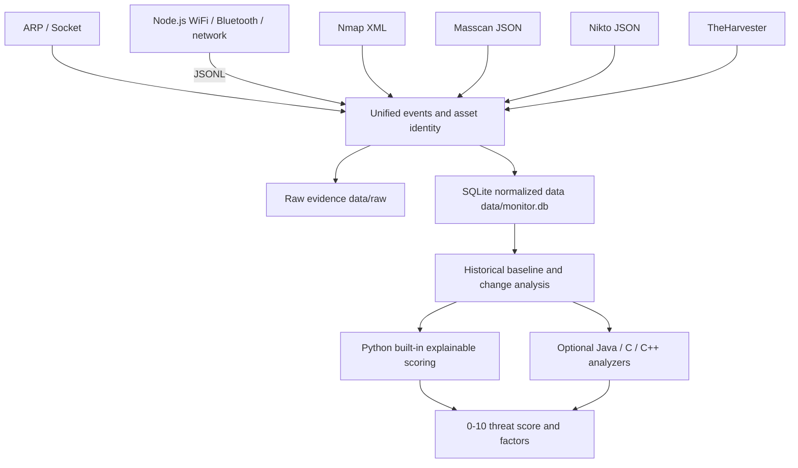

**目次：**

- [中国語](README.md)
- [英語](README.en.md)
- [日本語](README.ja.md)

# NETRUNNER — ローカルセキュリティデータ分析システム（macOS）


NETRUNNER は、自分が所有するか、テストについて書面による許可を得ているネットワークおよびデバイス向けのものです。もはや単なる「1回スキャンを実行してレポートを1つ出力する」スクリプトではなく、**収集、永続化、履歴比較、説明可能な脅威スコアリング**を中心としたローカル分析システムです。

システムは、統一されたパイプラインを通じて以下のデータを受け付けます：

- ARP と Socket による一般的なポートのプローブ。
- 近くにあるネットワークデバイス、WiFi、Bluetooth の観測。
- Nmap の構造化 XML。
- Masscan の JSON。
- Nikto の構造化された脆弱性。
- TheHarvester による OSINT。
- オプションの Java、C/C++、またはその他のローカル実行可能な分析バックエンド。

> 脅威スコアはトリアージの優先度であり、確認済みの侵入や脆弱性ではありません。収集されたオープンポート、WiFi、Bluetooth のデータが存在しないことも、安全である証明にはなりません。

## 目次

- [利用制限](#利用制限)
- [データアーキテクチャ](#データアーキテクチャ)
  - [3つのデータ層](#3つのデータ層)
- [識別情報と履歴ベースライン](#識別情報と履歴ベースライン)
- [脅威分析の根拠](#脅威分析の根拠)
- [クイックスタート](#クイックスタート)
- [統一 CLI](#統一-cli)
- [収集ティアのトレードオフ](#収集ティアのトレードオフ)
- [Java / C / C++ 外部分析バックエンド](#java--c--c-外部分析バックエンド)
- [Node.js スタンドアロン収集器と JSONL](#nodejs-スタンドアロン収集器と-jsonl)
- [ビルドと `dist/` の制限](#ビルドと-dist-の制限)
- [レガシーエントリの互換性](#レガシーエントリの互換性)
- [ディレクトリ構成](#ディレクトリ構成)
- [テストと静的チェック](#テストと静的チェック)
- [既知の制限](#既知の制限)

## 利用制限

- 自分が所有するか、**書面による許可**を得ているネットワーク、ドメイン、デバイスにのみ使用してください。
- `full` モードは明示的に許可された IPv4 を対象とし、全ポートの Nmap、Masscan、Nikto を実行する場合があり、home ティアより影響が顕著に大きくなります。ドメインの OSINT では明示的な TheHarvester サブコマンドを使用します。
- 許可されていない第三者のネットワークや、公開インターネット上のターゲットをスキャンしないでください。
- ネットワークの手法で検出できるのは、オンラインまたは信号を発しているデバイスだけです。オフラインの SD カードカメラは引き続き物理的な点検が必要です。

## データアーキテクチャ



### 3つのデータ層

1. **raw 証拠**: `data/raw/<date>/<run-id>/`
   - 収集ツールのオリジナルの JSON、JSONL、XML 解析結果、診断テキストを保存します。
   - 識別情報の正規化マイグレーションは、これらの raw ファイルを変更しません。
2. **SQLite 正規化コア**: `data/monitor.db`
   - スキャンバッチ、チャネルごとの完了ステータス、長期資産、識別情報のエイリアス、観測、オープンサービス、脆弱性の検出結果、脅威スコア。
3. **JSON 拡張属性**
   - 収集ツール固有のフィールドを保存し、ツールごとの頻繁なテーブル変更を避けます。

SQLite は Python のみが書き込みを行い、複数の言語が同時にデータベースへ書き込むことによるロック競合やデータ形式の分裂を避けます。Java/C/C++ アナライザは stdin/stdout の JSON 契約を通じて実行されます。

## 識別情報と履歴ベースライン

- ネットワークデバイスは、デフォルトで MAC アドレスを長期的な識別情報として使用します。
- WiFi は BSSID を、Bluetooth はデバイスアドレスを使用します。
- 1回の信頼できる観測に MAC と IP の両方が含まれる場合、システムはその IP を該当する MAC 資産のエイリアスとして登録し、Nmap/Nikto の結果を同じデバイスに関連付けられるようにします。
- 資産は、ベンダー、名前、SSID の類似性だけを根拠に自動的に統合されることは決してありません。
- macOS の ARP の短い MAC（例：`0:1a:eb:a6:4a:60`）は `00:1A:EB:A6:4A:60` に正規化されます。
- マルチキャストアドレスは、長期的なデバイス資産として保存されません。
- デフォルトでは、同じスコープで成功または部分成功した最新のバッチが比較対象になります。固定のベースラインを設定することもできます。

## 脅威分析の根拠

各資産には、`0–10` のスコア、レベル、信頼度、説明可能な因子が付与されます。現在の内蔵モデルは以下を組み合わせています：

- 機密性の高いオープンポート（例：Telnet、SMB、RTSP、RDP、Redis、MongoDB）。
- 履歴ベースラインと比べて新たに開放された機密ポート。
- 新たに出現した資産。
- Nikto の構造化された脆弱性の深刻度。
- 怪しいベンダー、名前、信号に対する収集ツールのヒューリスティック。
- 同じ機密ポートの履歴上の継続的な露出。
- 独立したエビデンスチャネルの数。似た2つの収集ツールを完全に独立したエビデンスとして扱うわけではありません。
- 履歴上の繰り返し回数と構造化された脆弱性エビデンス。

レポートには `data_quality` も含まれます：

- どの収集ツールが要求され、各チャネルが `success`、`skipped`、実行失敗、プロトコル失敗のどれであるか。
- どの収集ツールが実際に構造化された観測を生成したか。
- `coverage_ratio`：正常に完了したチャネルの割合。オブジェクトを0件収集しても成功とみなされます。
- `observation_coverage_ratio`：実際に構造化された観測を生成したチャネルの割合。
- オブジェクト0件で成功したチャネルと、オープンサービスレコードの数。
- 権限不足、オブジェクト未検出、収集失敗などによって生じうるデータの盲点。

## クイックスタート

1. `環境检查.command`（環境チェック）をダブルクリックします。メインフローには **Python 3** と **Node.js 18+** が必要です。Nmap、Masscan、Nikto、TheHarvester は、それぞれ `quick`、`full`、OSINT 用途の拡張依存としてマークされています。
2. `启动器.command`（ランチャー）をダブルクリックします。
3. メインメニューは以下を優先します：
   - 家庭ネットワークのフル収集と脅威分析。
   - 指定したターゲットのクイック統合分析。
   - 指定された許可済み IPv4 のフル統合分析。
   - 最新の脅威レポート。
   - 履歴の変化。
   - スキャン履歴。

## 統一 CLI

```bash
# 実際の home ティア：ARP/Socket + Node のネットワーク/WiFi/Bluetooth、自動保存
python3 source/netrunner.py collect --profile home

# 指定した許可済みターゲット：home 収集 + Nmap
python3 source/netrunner.py collect --profile quick --target 192.168.1.20

# 書面による許可を得た指定 IP：深い Nmap/Masscan/Nikto 収集
python3 source/netrunner.py collect --profile full --target 192.0.2.25

# 許可されたドメインの公開情報収集では、TheHarvester を明示的に選択すること。ドメインの例を Masscan のターゲットとして書かない
python3 source/recon.py authorized.example --type theharvester --domain authorized.example

# この実行だけを分析し、公式の履歴データベースを汚染しない
python3 source/netrunner.py collect --profile home --no-store

# stdout は JSON のみを出力し、収集ログは stderr へ
python3 source/netrunner.py collect --profile home --json

# 履歴とレポートを表示
python3 source/netrunner.py history
python3 source/netrunner.py report
python3 source/netrunner.py report --run-id <run-id>
python3 source/netrunner.py changes
python3 source/netrunner.py changes --run-id <run-id> --baseline <baseline-run-id>

# 同じスコープのスキャン用に固定ベースラインを設定
python3 source/netrunner.py baseline <run-id>

# 管理下の識別情報のエイリアスを明示的に登録
python3 source/netrunner.py alias <asset-id> ip 192.168.1.20
```

## 収集ティアのトレードオフ

| ティア | データソース | 強み | コストと制限 |
|---|---|---|---|
| `home` | ARP/Socket、ネットワーク、WiFi、Bluetooth | 繰り返し実行して家庭の履歴ベースラインを作るのに適している | ポート範囲が狭い。WiFi/Bluetooth は macOS の権限やシステムインターフェースの影響を受ける可能性がある |
| `quick` | `home` + Nmap | サービス識別がより信頼でき、単一の許可済みターゲットの調査に適している | スキャンが目立ち、実行時間が長い |
| `full` | `quick` + Masscan/Nikto | 明示的に許可された IP に対する、より深いポートおよび Web チェック | 実行時間が最も長く、ネットワークへの影響が最大。ドメインを Masscan の例やデフォルトターゲットとして直接使用しない |
| 明示的 OSINT | TheHarvester | 許可されたドメインの公開情報を収集 | ドメインのみを扱う。高度なエントリでは明示的な `--type theharvester` を使用する |

推奨されるフローは、まず `home` を継続的に実行して通常のベースラインを作り、その後、優先度の高いデバイスに `quick` を使用することです。`full` は明示的に許可された IP の深い調査にのみ使用します。ドメインの OSINT では明示的な TheHarvester サブコマンドを使用し、「公開情報」エントリを能動的なフルスキャンと誤認しないようにします。

## Java / C / C++ 外部分析バックエンド

`NETRUNNER_ANALYZER_CMD` を設定すると、外部アナライザは収集の完了ごと、およびレポートの再生成ごとに呼び出されます：

```bash
NETRUNNER_ANALYZER_CMD="java -jar analyzer.jar" \
python3 source/netrunner.py report

NETRUNNER_ANALYZER_CMD="./bin/threat_analyzer" \
NETRUNNER_ANALYZER_TIMEOUT=180 \
python3 source/netrunner.py collect --profile home
```

実行契約：

1. コマンドはシェルを経由せず、`shlex.split()` で解析されます。
2. stdin は UTF-8 の JSON を受け取ります：
   - `contract_version`。
   - スキャンバッチの `run`。
   - 履歴の変化 `changes`。
   - 資産・観測・サービスの `assets`。
   - Python 内蔵結果の `built_in_analysis`。ハイブリッドモデルやフォールバックの参照に使用できます。
3. stdout は JSON オブジェクトをちょうど1つだけ含み、少なくとも以下を提供しなければなりません：

```json
{
  "overall_score": 7.4,
  "overall_level": "high",
  "assets": []
}
```

4. `overall_score` は `0–10` の範囲内でなければならず、`overall_level` は `none/low/medium/high/critical` のみが許可され、スコアのしきい値と一致しなければなりません。`assets` は配列でなければなりません。
5. 資産の出力は、厳格な「既存の資産のみを分析する」増分契約に従います：
   - 参照できるのは、stdin の `assets` に既に存在する正の整数の `asset_id` だけです。新しい資産の捏造、ID の重複、識別情報の変更、収集エビデンスの偽装をしてはいけません。
   - stdin の `changes` は、Python が履歴データベースから生成した資産/ポートの増分ファクトです。外部アナライザはこれらのファクトを消化すべきであり、観測なしの単一の実行を直接「資産の消失」と解釈してはいけません。
   - 外部の `assets` は、`asset_id` 単位で適用される増分パッチです。返されなかった資産は Python 内蔵結果を保持し、空配列を返しても資産は削除されません。
   - 各パッチは `score`、`level`、`confidence`、`factors`、`label` を上書きできます。スコア・レベル・信頼度・因子の構造は厳格に検証され、未知または重複する `asset_id` は完全なフォールバックを引き起こします。
   - 統合された最終的な資産スコアは `threat_scores` に書き戻され、現在のレポートがデータベース内の最終ランキングと一致するように保たれます。
6. 外部プロセスがタイムアウトした場合、非ゼロで終了した場合、非 JSON を出力した場合、またはフィールドが欠落している場合でも、システムはレポートを失いません。Python 内蔵の分析にフォールバックし、その理由を `backend_warning` で説明します。
7. stderr は `analysis_backend.stderr` に記録されます。ログを stdout に書かないでください。

この設計により、将来的に Java での大規模なルールグラフや C/C++ での高性能な特徴量集約を実装しながら、Python のオーケストレーション、SQLite ストレージ、旧 CLI との互換性を維持できます。

## Node.js スタンドアロン収集器と JSONL

`源码/spy_detector.js` は Node.js 18+ が必要です。コマンド実行は `shell:false` の引数配列を使用し、コマンドのタイムアウト、起動失敗、非ゼロ終了、解析失敗は決して「オブジェクト0件の成功」として偽装されません。

```bash
# 人間が読めるモード
node 源码/spy_detector.js --network

# stdout には JSONL のみを含め、診断情報と人間向けログは stderr へ
node 源码/spy_detector.js --jsonl --run-id <run-id>
```

JSONL には2種類のレコードが含まれます：

- 観測レコード：`source`、`kind: "observation"`、`identity`、`attributes` を保持し、資産ストレージに入ることができます。
- 収集ツールのステータスレコード：`event_type: "collector_status"` または `event_type: "collector_complete"` を使用し、**`identity` を含まず、決して観測として偽装されません**。完了イベントの `status` は以下を区別します：
  - `success`：コマンドと解析が成功。`object_count: 0` と `zero_objects: true` は、信頼できる「オブジェクト0件の成功」を意味します。
  - `command_failed`：起動失敗、タイムアウト、または非ゼロ終了。`return_code`、`timed_out`、`stderr` を伴う場合があります。
  - `parse_failed`：コマンドは成功したが、構造化された出力を解析できませんでした。

`source/netrunner.py` は stdout をストリーミングモードで読み取り、まず `event_type` でステータスレコードをルーティングし、本物の観測レコードだけを資産ストレージに送ります。さらに、`run_id`、各要求チャネルの `collector_status`/`collector_complete`、オブジェクト数、重複/未知のイベント、Node の終了コードを検証します。タイムアウト時にはプロセスを終了させますが、タイムアウト前に出力された JSONL と stderr は保持して解析します。完了ステータスは SQLite の `collector_results` に書き込まれ、バッチステータスや後のレポートに使用されます。`--help` テキストは stderr に書き込まれ、stdout は空のままです。未知の引数は終了コード `2` で終了します。

## ビルドと `dist/` の制限

`源码/package.json` は Node.js 18+ と `@yao-pkg/pkg` ビルド依存を固定しています。ビルドは、ランチャー契約に必要なアーキテクチャ固有のファイルを生成します：

```bash
cd 源码
npm install
npm run build
# ../dist/spy_detector_mac_x64
# ../dist/spy_detector_mac_arm64
```

- `dist/` の成果物は `x86_64` / `arm64` で分割されており、アーキテクチャをまたいで実行することはできません。リポジトリにファイルが既に存在しても、両アーキテクチャがビルド・検証済みであることを意味しません。
- 事前コンパイルされたファイルは、実行ビット、署名、公証、Gatekeeper ポリシーの影響を受ける可能性があります。ランチャーはこれらの診断情報を報告しますが、システムや組織のポリシーを回避しません。
- これらのバイナリがラップするのはスタンドアロンの Node.js 収集ツールだけです。Python データプラットフォームは含まれておらず、**メインフローの Python 3 と Node.js 18+ の要件を置き換えることはできません**。

## レガシーエントリの互換性

以下のエントリは引き続き動作し、デフォルトで統一履歴データベースにも書き込みます：

```bash
python3 source/audit_engine.py
python3 source/penetration_test.py 192.168.1.20 --quick
python3 source/recon.py 192.168.1.20 --type nmap
```

これらは `--no-store` に対応し、ペネトレーションテストとリコンのエントリは `--json` にも対応しています。新しい作業では、メインフローの `source/netrunner.py` を使用してください。

## ディレクトリ構成

```text
netrunner-security-monitor/
├── README.md
├── 启动器.command
├── 环境检查.command
├── data/
│   ├── monitor.db
│   └── raw/<date>/<run-id>/
├── dist/
│   ├── spy_detector_mac_x64
│   └── spy_detector_mac_arm64
├── source/
│   ├── __init__.py
│   ├── netrunner.py
│   ├── data_platform.py
│   ├── analyzer_backend.py
│   ├── audit_engine.py
│   ├── penetration_test.py
│   └── recon.py
├── tests/
│   ├── test_data_platform.py
│   ├── test_netrunner.py
│   └── test_tool_parsers.py
└── 源码/
    ├── package.json
    └── spy_detector.js
```

## テストと静的チェック

オフラインのテストは、どのスキャンターゲットにも接続しません：

```bash
python3 -m unittest discover -s tests -v
python3 -m py_compile source/*.py tests/*.py
node --check 源码/spy_detector.js
bash -n 启动器.command
bash -n 環境检查.command
```

## 既知の制限

- 最初の比較可能なバッチには履歴ベースラインがないため、資産はまだ自動的には「新規」としてカウントされません。変化に意味が出るのは、2つ目の同じスコープのバッチ以降です。
- WiFi と Bluetooth は、macOS のバージョン、システムインターフェース、位置情報/Bluetooth の権限の影響を受けます。レポートは、観測を生成しなかったチャネルをデータ品質のヒントとして列挙します。
- ARP テーブルには、企業ネットワーク、VPN、ホットスポット、仮想ネットワーク由来の多数のネイバーが含まれることがあり、そのすべてが家庭の物理デバイスとは限りません。
- オープンポートは露出のファクトであり、自動的に脆弱性になるわけではありません。Nikto などのスキャナの結果も、手動での確認が必要です。
- 現在の内蔵スコアリングは説明可能なルールモデルであり、侵入検知の機械学習モデルではありません。外部バックエンドは、より複雑な統計、グラフ分析、モデル推論に使用できます。
