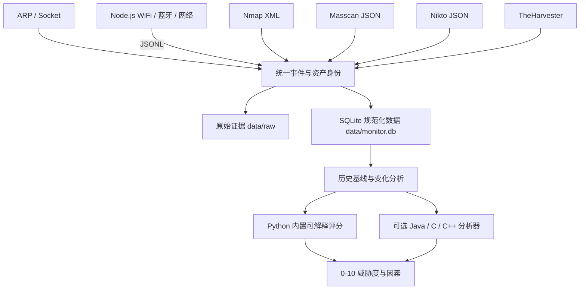

# NETRUNNER 本地安全数据分析系统（macOS）

NETRUNNER 用于你自己拥有或已获得书面授权的网络与设备。它不再只是“一次扫描、打印一次报告”的脚本，而是一个以**采集、持久化、历史比较和可解释威胁评分**为中心的本地分析系统。

系统统一接收以下数据：

- ARP 与 Socket 常见端口探测；
- 周边网络设备、WiFi 与蓝牙观测；
- Nmap 结构化 XML；
- Masscan JSON；
- Nikto 结构化漏洞；
- TheHarvester OSINT；
- 可选的 Java、C/C++ 或其它本地可执行分析后端。

> 威胁度是排查优先级，不等同于已确认入侵或漏洞。未采集到开放端口、WiFi 或蓝牙数据，也不等于已证明安全。

## 使用限制

- 仅用于你拥有或已获**书面授权**的网络、域名和设备。
- `full` 模式面向明确授权的 IPv4，可能运行全端口 Nmap、Masscan 和 Nikto，影响明显高于家庭档位；域名 OSINT 使用显式 TheHarvester 子命令。
- 不要对未经授权的第三方网络或公网目标执行扫描。
- 网络方法只能发现联网或发射信号的设备；离线 SD 卡摄像头仍需要物理检查。

## 数据架构



### 三层数据

1. **原始证据**：`data/raw/<日期>/<run-id>/`
   - 保存采集器原始 JSON、JSONL、XML 解析结果和诊断文本。
   - 身份规范化迁移不会修改这些原始文件。
2. **SQLite 规范化核心**：`data/monitor.db`
   - 扫描批次、逐采集通道完成状态、长期资产、身份别名、观测、开放服务、漏洞发现和威胁分。
3. **JSON 扩展属性**
   - 保存不同采集器的专有字段，避免为了每个工具频繁改表。

SQLite 只由 Python 写入，避免多个语言同时写数据库导致锁竞争或数据格式分裂。Java/C/C++ 分析器通过 stdin/stdout JSON 合约运行。

## 身份与历史基线

- 网络设备优先使用 MAC 作为长期身份。
- WiFi 优先使用 BSSID，蓝牙优先使用设备地址。
- 同一条可信观测同时含 MAC 和 IP 时，系统把 IP 登记为该 MAC 资产的别名，以便 Nmap/Nikto 结果关联到同一设备。
- 不会仅凭厂商、名称或 SSID 相似度自动合并资产。
- macOS ARP 的短 MAC（如 `0:1a:eb:a6:4a:60`）会规范化为 `00:1A:EB:A6:4A:60`。
- 组播地址不会作为长期设备资产。
- 默认与最近一个相同范围、成功或部分成功的批次比较，也可以设置固定基线。

## 威胁分析依据

每个资产生成 `0–10` 分、等级、置信度和可解释因素。当前内置模型综合：

- 敏感开放端口，例如 Telnet、SMB、RTSP、RDP、Redis、MongoDB；
- 相比历史基线新开放的敏感端口；
- 新出现的资产；
- Nikto 结构化漏洞严重度；
- 采集器的可疑厂商、名称或信号规则；
- 同一敏感端口的历史持续暴露；
- 独立证据通道数量，而不是简单把两个相似采集器当作完全独立证据；
- 历史重复次数和结构化漏洞证据。

报告同时包含 `data_quality`：

- 请求了哪些采集器，以及每个通道是 `success`、`skipped`、执行失败还是协议失败；
- 哪些采集器实际产生了结构化观测；
- `coverage_ratio`：成功完成的通道占比，成功零对象也算采集成功；
- `observation_coverage_ratio`：真正产生结构化观测的通道占比；
- 哪些通道成功但为零对象，以及开放服务记录数量；
- 权限不足、未发现对象或采集失败可能造成的数据盲区。

## 快速开始

1. 双击 `环境检查.command`。主流程要求 **Python 3** 和 **Node.js 18+**；Nmap、Masscan、Nikto、TheHarvester 会按 `quick`、`full`、OSINT 用途分别标为扩展依赖。
2. 双击 `启动器.command`。
3. 主菜单优先提供：
   - 家庭全量采集与威胁分析；
   - 指定目标快速综合分析；
   - 指定授权 IPv4 的完整综合分析；
   - 最新威胁报告；
   - 历史变化；
   - 扫描历史。

## 统一命令行

```bash
# 真实家庭档位：ARP/Socket + Node 网络/WiFi/蓝牙，自动保存
python3 source/netrunner.py collect --profile home

# 指定授权目标：家庭采集 + Nmap
python3 source/netrunner.py collect --profile quick --target 192.168.1.20

# 指定已书面授权的 IP：Nmap/Masscan/Nikto 深度采集
python3 source/netrunner.py collect --profile full --target 192.0.2.25

# 授权域名的公开信息收集应显式选择 TheHarvester，不把域名示例写成 Masscan 目标
python3 source/recon.py authorized.example --type theharvester --domain authorized.example

# 只分析本次，不污染正式历史库
python3 source/netrunner.py collect --profile home --no-store

# stdout 仅输出 JSON；采集日志进入 stderr
python3 source/netrunner.py collect --profile home --json

# 查看历史与报告
python3 source/netrunner.py history
python3 source/netrunner.py report
python3 source/netrunner.py report --run-id <run-id>
python3 source/netrunner.py changes
python3 source/netrunner.py changes --run-id <run-id> --baseline <baseline-run-id>

# 设置同范围扫描的固定基线
python3 source/netrunner.py baseline <run-id>

# 显式登记受控身份别名
python3 source/netrunner.py alias <asset-id> ip 192.168.1.20
```

## 采集档位权衡

| 档位 | 数据源 | 优点 | 代价与限制 |
|---|---|---|---|
| `home` | ARP/Socket、网络、WiFi、蓝牙 | 适合重复运行和建立家庭历史基线 | 端口范围较小；WiFi/蓝牙可能受 macOS 权限和系统接口限制 |
| `quick` | `home` + Nmap | 服务识别更可靠，适合调查单个授权目标 | 扫描更明显，运行时间更长 |
| `full` | `quick` + Masscan/Nikto | 对明确授权的 IP 做更深端口与 Web 检查 | 时间最长、网络影响最大；不要把域名直接当作 Masscan 示例或默认目标 |
| 显式 OSINT | TheHarvester | 收集获授权域名的公开信息 | 只处理域名；在高级入口使用明确的 `--type theharvester` |

推荐先连续运行 `home` 建立正常历史，再对高优先级设备使用 `quick`。`full` 只用于明确授权 IP 的深度调查；域名 OSINT 使用显式的 TheHarvester 子命令，避免把“公开情报”入口误解为主动全套扫描。

## Java / C / C++ 外部分析后端

设置 `NETRUNNER_ANALYZER_CMD` 后，每次采集完成和重新生成报告时都会尝试调用外部分析器：

```bash
NETRUNNER_ANALYZER_CMD="java -jar analyzer.jar" \
python3 source/netrunner.py report

NETRUNNER_ANALYZER_CMD="./bin/threat_analyzer" \
NETRUNNER_ANALYZER_TIMEOUT=180 \
python3 source/netrunner.py collect --profile home
```

执行合约：

1. 命令由 `shlex.split()` 解析，不经过 shell。
2. stdin 收到 UTF-8 JSON：
   - `contract_version`；
   - 扫描批次 `run`；
   - 历史变化 `changes`；
   - 资产、观测与服务 `assets`；
   - Python 内置结果 `built_in_analysis`，可用于混合模型或回退参考。
3. stdout 必须只包含一个 JSON 对象，至少提供：

```json
{
  "overall_score": 7.4,
  "overall_level": "high",
  "assets": []
}
```

4. `overall_score` 必须位于 `0–10`，`overall_level` 只允许 `none/low/medium/high/critical`，且必须与分数阈值一致；`assets` 必须是数组。
5. 资产输出遵守严格的“只分析既有资产”增量契约：
   - 只能引用 stdin `assets` 中已有的正整数 `asset_id`，不能发明新资产、重复 ID、修改身份或伪造采集证据；
   - stdin `changes` 是 Python 根据历史库生成的资产/端口增量事实，外部分析器应消费这些事实，而不是把一次未观测到对象直接解释为资产消失；
   - 外部 `assets` 是按 `asset_id` 应用的增量补丁；未返回的资产保留 Python 内置结果，返回空数组也不会删除资产；
   - 每个补丁可覆盖 `score`、`level`、`confidence`、`factors`、`label`。分数、等级、置信度和因素结构会被严格校验，未知或重复 `asset_id` 会触发整体回退；
   - 合并后的最终资产分数会写回 `threat_scores`，使当前报告与数据库中的最终排序一致。
6. 外部进程超时、退出非零、输出非 JSON 或缺字段时，系统不会丢失报告，而是回退到 Python 内置分析，并在 `backend_warning` 中说明原因。
7. stderr 会记录在 `analysis_backend.stderr`，不要把日志写入 stdout。

这种设计允许未来用 Java 实现大规模规则图、用 C/C++ 实现高性能特征聚合，同时保留 Python 编排、SQLite 存储和旧 CLI 兼容性。

## Node.js 独立采集器与 JSONL

`源码/spy_detector.js` 要求 Node.js 18+。命令执行使用 `shell:false` 与参数数组；命令超时、启动失败、非零退出和解析失败不会被伪装成“成功但零对象”。

```bash
# 人类可读模式
node 源码/spy_detector.js --network

# stdout 只含 JSONL；诊断与人类日志进入 stderr
node 源码/spy_detector.js --jsonl --run-id <run-id>
```

JSONL 包含两类记录：

- 观测记录：保留 `source`、`kind: "observation"`、`identity` 和 `attributes`，可进入资产存储；
- 采集器状态记录：使用 `event_type: "collector_status"` 或 `event_type: "collector_complete"`，**不带 `identity`，也不伪装成 observation**。完成事件的 `status` 区分：
  - `success`：命令与解析成功；`object_count: 0`、`zero_objects: true` 表示可信的成功零对象；
  - `command_failed`：启动失败、超时或非零退出，并可带 `return_code`、`timed_out`、`stderr`；
  - `parse_failed`：命令成功但结构化输出无法解析。

`source/netrunner.py` 会流式读取 stdout，先按 `event_type` 路由状态记录，只把真正的观测记录送入资产入库；同时校验 `run_id`、每个请求通道的 `collector_status`/`collector_complete`、对象计数、重复/未知事件和 Node 退出码。超时时会终止进程，但保留并解析超时前已经输出的 JSONL 与 stderr。完成状态写入 SQLite `collector_results`，供批次状态和后续报告使用。`--help` 的帮助文字写入 stderr，stdout 保持为空；未知参数退出码为 `2`。

## 构建与 `dist/` 限制

`源码/package.json` 固定声明 Node.js 18+ 和 `@yao-pkg/pkg` 构建依赖。构建会分别生成启动器约定的架构文件：

```bash
cd 源码
npm install
npm run build
# ../dist/spy_detector_mac_x64
# ../dist/spy_detector_mac_arm64
```

- `dist/` 产物按 `x86_64` / `arm64` 区分，不能跨架构运行；仓库中是否已有某个文件不代表两个架构都已构建或已验证。
- 预编译文件可能受执行位、签名、公证和 Gatekeeper 策略影响；启动器会报告这些诊断，但不会绕过系统或组织策略。
- 这些二进制只封装独立 Node.js 采集器，不包含 Python 数据平台，也**不能替代主流程对 Python 3 与 Node.js 18+ 的要求**。

## 旧入口兼容

以下入口仍可使用，默认也会写入统一历史数据库：

```bash
python3 source/audit_engine.py
python3 source/penetration_test.py 192.168.1.20 --quick
python3 source/recon.py 192.168.1.20 --type nmap
```

它们支持 `--no-store`；渗透测试和侦察入口也支持 `--json`。新的主流程建议使用 `source/netrunner.py`。

## 目录结构

```text
监控探测/
├── README.md
├── 启动器.command
├── 环境检查.command
├── data/
│   ├── monitor.db
│   └── raw/<日期>/<run-id>/
├── dist/
│   ├── spy_detector_mac_x64
│   └── spy_detector_mac_arm64
├── source/
│   ├── __init__.py
│   ├── netrunner.py
│   ├── data_platform.py
│   ├── analyzer_backend.py
│   ├── audit_engine.py
│   ├── penetration_test.py
│   └── recon.py
├── tests/
│   ├── test_data_platform.py
│   ├── test_netrunner.py
│   └── test_tool_parsers.py
└── 源码/
    ├── package.json
    └── spy_detector.js
```

## 测试与静态检查

离线测试不会连接任何扫描目标：

```bash
python3 -m unittest discover -s tests -v
python3 -m py_compile source/*.py tests/*.py
node --check 源码/spy_detector.js
bash -n 启动器.command
bash -n 环境检查.command
```

## 已知限制

- 首个可比批次没有历史基线，因此不会把所有资产自动计为“新增”。从第二个相同范围批次开始才有变化意义。
- WiFi 和蓝牙受 macOS 版本、系统接口、定位/蓝牙权限影响；报告会把没有产生观测的通道列为数据质量提示。
- ARP 表可能包含企业网络、VPN、热点或虚拟网络中的大量邻居，不一定都是家庭物理设备。
- 端口开放是暴露事实，不自动等于漏洞；Nikto 等扫描器的结果也需要人工复核。
- 当前内置评分是可解释规则模型，不是入侵检测机器学习模型。外部后端可用于更复杂的统计、图分析或模型推理。
