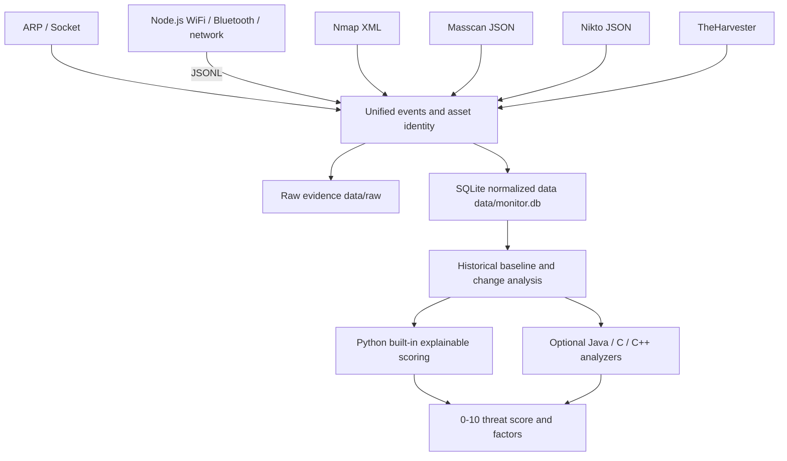

# NETRUNNER — Local Security Data Analysis System (macOS)


NETRUNNER is for networks and devices that you own or have written authorization to test. It is no longer just a "run one scan, print one report" script, but a local analysis system centered on **collection, persistence, historical comparison, and explainable threat scoring**.

The system accepts the following data through a unified pipeline:

- ARP and Socket common-port probing;
- Nearby network devices, WiFi, and Bluetooth observations;
- Nmap structured XML;
- Masscan JSON;
- Nikto structured vulnerabilities;
- TheHarvester OSINT;
- Optional Java, C/C++, or other local executable analysis backends.

> The threat score is a triage priority; it is not a confirmed intrusion or vulnerability. Absence of collected open ports, WiFi, or Bluetooth data is not proof of security either.

## Usage Restrictions

- Only use on networks, domains, and devices that you own or have **written authorization** for.
- The `full` mode targets explicitly authorized IPv4 and may run full-port Nmap, Masscan, and Nikto, with noticeably higher impact than the home tier; domain OSINT uses an explicit TheHarvester subcommand.
- Do not scan unauthorized third-party networks or public internet targets.
- Network methods can only discover devices that are online or emitting signals; offline SD-card cameras still require physical inspection.

## Data Architecture



### Three Data Layers

1. **Raw evidence**: `data/raw/<date>/<run-id>/`
   - Stores the collectors' original JSON, JSONL, XML parsing results, and diagnostic text.
   - Identity normalization migrations do not modify these raw files.
2. **SQLite normalized core**: `data/monitor.db`
   - Scan batches, per-channel completion status, long-term assets, identity aliases, observations, open services, vulnerability findings, and threat scores.
3. **JSON extension attributes**
   - Stores collector-specific fields, avoiding frequent table changes for each tool.

SQLite is written only by Python, avoiding lock contention or data format splits caused by multiple languages writing the database simultaneously. Java/C/C++ analyzers run through a stdin/stdout JSON contract.

## Identity and Historical Baseline

- Network devices use the MAC address as the long-term identity by default.
- WiFi uses the BSSID, and Bluetooth uses the device address.
- When a single trusted observation contains both MAC and IP, the system registers the IP as an alias of that MAC asset so that Nmap/Nikto results can be correlated to the same device.
- Assets are never merged automatically based on vendor, name, or SSID similarity alone.
- macOS ARP short MACs (e.g. `0:1a:eb:a6:4a:60`) are normalized to `00:1A:EB:A6:4A:60`.
- Multicast addresses are not stored as long-term device assets.
- By default, comparison is against the most recent batch with the same scope that succeeded or partially succeeded; you can also set a fixed baseline.

## Threat Analysis Basis

Each asset receives a `0–10` score, a level, a confidence, and explainable factors. The current built-in model combines:

- Sensitive open ports, e.g. Telnet, SMB, RTSP, RDP, Redis, MongoDB;
- Sensitive ports newly opened compared to the historical baseline;
- Newly appearing assets;
- Nikto structured vulnerability severity;
- Collector heuristics on suspicious vendors, names, or signals;
- Historical sustained exposure of the same sensitive port;
- The number of independent evidence channels, rather than simply treating two similar collectors as fully independent evidence;
- Historical repetition counts and structured vulnerability evidence.

Reports also include `data_quality`:

- Which collectors were requested, and whether each channel is `success`, `skipped`, execution-failed, or protocol-failed;
- Which collectors actually produced structured observations;
- `coverage_ratio`: the share of channels that completed successfully; collecting zero objects still counts as success;
- `observation_coverage_ratio`: the share of channels that actually produced structured observations;
- Which channels succeeded with zero objects, and the number of open-service records;
- Data blind spots that may be caused by insufficient permissions, no objects found, or collection failures.

## Quick Start

1. Double-click `环境检查.command` (environment check). The main flow requires **Python 3** and **Node.js 18+**; Nmap, Masscan, Nikto, and TheHarvester are marked as extended dependencies for `quick`, `full`, and OSINT use respectively.
2. Double-click `启动器.command` (launcher).
3. The main menu prioritizes:
   - Full home collection and threat analysis;
   - Quick combined analysis of a specified target;
   - Full combined analysis of a specified authorized IPv4;
   - Latest threat report;
   - Historical changes;
   - Scan history.

## Unified CLI

```bash
# Real home tier: ARP/Socket + Node network/WiFi/Bluetooth, auto-saved
python3 source/netrunner.py collect --profile home

# Specified authorized target: home collection + Nmap
python3 source/netrunner.py collect --profile quick --target 192.168.1.20

# Specified written-authorized IP: deep Nmap/Masscan/Nikto collection
python3 source/netrunner.py collect --profile full --target 192.0.2.25

# Public information collection for an authorized domain should explicitly choose TheHarvester; do not write domain examples as Masscan targets
python3 source/recon.py authorized.example --type theharvester --domain authorized.example

# Analyze this run only, without polluting the official history database
python3 source/netrunner.py collect --profile home --no-store

# stdout outputs JSON only; collection logs go to stderr
python3 source/netrunner.py collect --profile home --json

# View history and reports
python3 source/netrunner.py history
python3 source/netrunner.py report
python3 source/netrunner.py report --run-id <run-id>
python3 source/netrunner.py changes
python3 source/netrunner.py changes --run-id <run-id> --baseline <baseline-run-id>

# Set a fixed baseline for same-scope scans
python3 source/netrunner.py baseline <run-id>

# Explicitly register a controlled identity alias
python3 source/netrunner.py alias <asset-id> ip 192.168.1.20
```

## Collection Tier Trade-offs

| Tier | Data sources | Strengths | Costs and limits |
|---|---|---|---|
| `home` | ARP/Socket, network, WiFi, Bluetooth | Suitable for repeated runs and building a home history baseline | Smaller port range; WiFi/Bluetooth may be limited by macOS permissions and system interfaces |
| `quick` | `home` + Nmap | More reliable service identification, suitable for investigating a single authorized target | More visible scans, longer runtime |
| `full` | `quick` + Masscan/Nikto | Deeper port and web checks for explicitly authorized IPs | Longest runtime, highest network impact; do not use domains directly as Masscan examples or default targets |
| Explicit OSINT | TheHarvester | Collect public information for authorized domains | Handles domains only; use the explicit `--type theharvester` in the advanced entry |

The recommended flow is to run `home` continuously first to establish a normal baseline, then use `quick` for high-priority devices. `full` is only for deep investigation of explicitly authorized IPs; domain OSINT uses the explicit TheHarvester subcommand to avoid mistaking the "public intelligence" entry for an active full scan.

## Java / C / C++ External Analysis Backends

After setting `NETRUNNER_ANALYZER_CMD`, the external analyzer is invoked on every collection completion and report regeneration:

```bash
NETRUNNER_ANALYZER_CMD="java -jar analyzer.jar" \
python3 source/netrunner.py report

NETRUNNER_ANALYZER_CMD="./bin/threat_analyzer" \
NETRUNNER_ANALYZER_TIMEOUT=180 \
python3 source/netrunner.py collect --profile home
```

Execution contract:

1. The command is parsed with `shlex.split()`, not through a shell.
2. stdin receives UTF-8 JSON:
   - `contract_version`;
   - The scan batch `run`;
   - Historical changes `changes`;
   - Assets, observations, and services `assets`;
   - The Python built-in results `built_in_analysis`, usable for hybrid models or fallback reference.
3. stdout must contain exactly one JSON object providing at least:

```json
{
  "overall_score": 7.4,
  "overall_level": "high",
  "assets": []
}
```

4. `overall_score` must be within `0–10`, `overall_level` only allows `none/low/medium/high/critical` and must match the score thresholds; `assets` must be an array.
5. Asset output follows a strict "analyze existing assets only" incremental contract:
   - You may only reference positive-integer `asset_id`s that already exist in stdin `assets`; do not invent new assets, duplicate IDs, modify identities, or fabricate collection evidence;
   - stdin `changes` are asset/port incremental facts generated by Python from the history database; external analyzers should consume these facts rather than interpreting a single no-observation run directly as asset disappearance;
   - External `assets` are incremental patches applied by `asset_id`; assets not returned keep the Python built-in results, and returning an empty array does not delete assets;
   - Each patch may override `score`, `level`, `confidence`, `factors`, and `label`. Score, level, confidence, and factor structures are strictly validated; unknown or duplicate `asset_id`s trigger a full fallback;
   - The merged final asset scores are written back to `threat_scores`, keeping the current report consistent with the final ranking in the database.
6. When the external process times out, exits non-zero, outputs non-JSON, or lacks fields, the system does not lose the report; it falls back to the Python built-in analysis and explains the reason in `backend_warning`.
7. stderr is recorded in `analysis_backend.stderr`; do not write logs to stdout.

This design allows implementing large-scale rule graphs in Java or high-performance feature aggregation in C/C++ in the future, while keeping Python orchestration, SQLite storage, and old CLI compatibility.

## Node.js Standalone Collector and JSONL

`源码/spy_detector.js` requires Node.js 18+. Command execution uses `shell:false` with an argument array; command timeouts, startup failures, non-zero exits, and parse failures are never disguised as "success with zero objects".

```bash
# Human-readable mode
node 源码/spy_detector.js --network

# stdout contains JSONL only; diagnostics and human logs go to stderr
node 源码/spy_detector.js --jsonl --run-id <run-id>
```

JSONL contains two kinds of records:

- Observation records: keep `source`, `kind: "observation"`, `identity`, and `attributes`; they can enter asset storage;
- Collector status records: use `event_type: "collector_status"` or `event_type: "collector_complete"`, **without `identity`, and never disguised as observations**. The `status` of completion events distinguishes:
  - `success`: command and parsing succeeded; `object_count: 0` with `zero_objects: true` means a trusted success-with-zero-objects;
  - `command_failed`: startup failure, timeout, or non-zero exit, possibly with `return_code`, `timed_out`, `stderr`;
  - `parse_failed`: the command succeeded but the structured output could not be parsed.

`source/netrunner.py` reads stdout in streaming mode, routes status records by `event_type` first, and only sends genuine observation records into asset storage; it also validates `run_id`, the `collector_status`/`collector_complete` of each requested channel, object counts, duplicate/unknown events, and the Node exit code. On timeout it terminates the process but keeps and parses the JSONL and stderr already output before the timeout. Completion statuses are written to SQLite `collector_results` for batch status and later reports. The `--help` text is written to stderr, and stdout stays empty; unknown arguments exit with code `2`.

## Build and `dist/` Limitations

`源码/package.json` pins Node.js 18+ and the `@yao-pkg/pkg` build dependency. The build generates the architecture-specific files required by the launcher contract:

```bash
cd 源码
npm install
npm run build
# ../dist/spy_detector_mac_x64
# ../dist/spy_detector_mac_arm64
```

- `dist/` artifacts are split by `x86_64` / `arm64` and cannot run cross-architecture; whether a file already exists in the repo does not mean both architectures have been built or verified.
- Precompiled files may be affected by execute bits, signing, notarization, and Gatekeeper policies; the launcher reports these diagnostics but does not bypass system or organization policies.
- These binaries only wrap the standalone Node.js collector; they do not include the Python data platform and **cannot replace the main flow's requirement for Python 3 and Node.js 18+**.

## Legacy Entry Compatibility

The following entries still work and also write to the unified history database by default:

```bash
python3 source/audit_engine.py
python3 source/penetration_test.py 192.168.1.20 --quick
python3 source/recon.py 192.168.1.20 --type nmap
```

They support `--no-store`; the penetration-testing and reconnaissance entries also support `--json`. New work should use the main flow `source/netrunner.py`.

## Directory Structure

```text
netrunner-security-monitor/
├── README.md
├── 启动器.command
├── 环境检查.command
├── data/
│   ├── monitor.db
│   └── raw/<date>/<run-id>/
├── dist/
│   ├── spy_detector_mac_x64
│   └── spy_detector_mac_arm64
├── source/
│   ├── __init__.py
│   ├── netrunner.py
│   ├── data_platform.py
│   ├── analyzer_backend.py
│   ├── audit_engine.py
│   ├── penetration_test.py
│   └── recon.py
├── tests/
│   ├── test_data_platform.py
│   ├── test_netrunner.py
│   └── test_tool_parsers.py
└── 源码/
    ├── package.json
    └── spy_detector.js
```

## Tests and Static Checks

Offline tests never connect to any scan target:

```bash
python3 -m unittest discover -s tests -v
python3 -m py_compile source/*.py tests/*.py
node --check 源码/spy_detector.js
bash -n 启动器.command
bash -n 环境检查.command
```

## Known Limitations

- The first comparable batch has no historical baseline, so assets are not automatically counted as "new" yet. Changes only become meaningful from the second same-scope batch onward.
- WiFi and Bluetooth are affected by macOS versions, system interfaces, and location/Bluetooth permissions; the report lists channels that produced no observations as data-quality hints.
- The ARP table may contain many neighbors from corporate networks, VPNs, hotspots, or virtual networks, not all of which are physical home devices.
- An open port is an exposure fact, not automatically a vulnerability; scanner results such as Nikto also need manual review.
- The current built-in scoring is an explainable rule model, not an intrusion-detection machine-learning model. External backends can be used for more complex statistics, graph analysis, or model inference.
