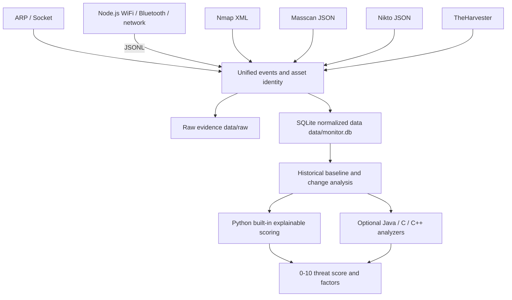

**目录：**

- [中文版](README.md)
- [英文版](README.en.md)
- [日文版](README.ja.md)

# NETRUNNER — 本地安全数据分析系统（macOS）


NETRUNNER 仅用于你拥有或已获得书面授权测试的网络和设备。它已不再只是一个"运行一次扫描、打印一份报告"的脚本，而是一个以**采集、持久化、历史对比和可解释威胁评分**为核心的本地分析系统。

系统通过统一的管道接受以下数据：

- ARP 和 Socket 常用端口探测；
- 附近的网络设备、WiFi 和蓝牙观测；
- Nmap 结构化 XML；
- Masscan JSON；
- Nikto 结构化漏洞；
- TheHarvester OSINT；
- 可选的 Java、C/C++ 或其他本地可执行分析后端。

> 威胁评分是分诊优先级；它不是已确认的入侵或漏洞。未采集到开放端口、WiFi 或蓝牙数据也不能证明安全。

## 目录

- [使用限制](#使用限制)
- [数据架构](#数据架构)
  - [三个数据层](#三个数据层)
- [身份与历史基线](#身份与历史基线)
- [威胁分析依据](#威胁分析依据)
- [快速开始](#快速开始)
- [统一 CLI](#统一-cli)
- [采集档位权衡](#采集档位权衡)
- [Java / C / C++ 外部分析后端](#java--c--c-外部分析后端)
- [Node.js 独立采集器与 JSONL](#nodejs-独立采集器与-jsonl)
- [构建与 `dist/` 限制](#构建与-dist-限制)
- [旧入口兼容性](#旧入口兼容性)
- [目录结构](#目录结构)
- [测试与静态检查](#测试与静态检查)
- [已知限制](#已知限制)

## 使用限制

- 仅在你拥有或已获得**书面授权**的网络、域名和设备上使用。
- `full` 模式针对明确授权的 IPv4，可能运行全端口 Nmap、Masscan 和 Nikto，影响明显高于 home 档位；域名 OSINT 使用显式的 TheHarvester 子命令。
- 不要扫描未授权的第三方网络或公共互联网目标。
- 网络方法只能发现在线或正在发出信号的设备；离线的 SD 卡摄像头仍需要物理检查。

## 数据架构



### 三个数据层

1. **原始证据**：`data/raw/<date>/<run-id>/`
   - 存放各采集器的原始 JSON、JSONL、XML 解析结果和诊断文本。
   - 身份规范化迁移不会修改这些原始文件。
2. **SQLite 规范化核心**：`data/monitor.db`
   - 扫描批次、各通道完成状态、长期资产、身份别名、观测记录、开放服务、漏洞发现和威胁评分。
3. **JSON 扩展属性**
   - 存放采集器特有的字段，避免为每个工具频繁变更表结构。

SQLite 只由 Python 写入，避免多种语言同时写数据库造成的锁竞争或数据格式分裂。Java/C/C++ 分析器通过 stdin/stdout JSON 契约运行。

## 身份与历史基线

- 网络设备默认以 MAC 地址作为长期身份。
- WiFi 使用 BSSID，蓝牙使用设备地址。
- 当单次可信观测同时包含 MAC 和 IP 时，系统会把该 IP 注册为该 MAC 资产的别名，使 Nmap/Nikto 结果能够关联到同一设备。
- 资产永远不会仅凭厂商、名称或 SSID 相似度自动合并。
- macOS ARP 短 MAC（如 `0:1a:eb:a6:4a:60`）会被规范化为 `00:1A:EB:A6:4A:60`。
- 组播地址不会作为长期设备资产存储。
- 默认情况下，对比对象是同一范围内最近一次成功或部分成功的批次；你也可以设置固定基线。

## 威胁分析依据

每个资产都会得到一个 `0–10` 的评分、一个等级、一个置信度和可解释的因子。当前内置模型综合了：

- 敏感的开放端口，例如 Telnet、SMB、RTSP、RDP、Redis、MongoDB；
- 与历史基线相比新开放的敏感端口；
- 新出现的资产；
- Nikto 结构化漏洞的严重程度；
- 采集器对可疑厂商、名称或信号的启发式判断；
- 同一敏感端口的历史持续暴露；
- 独立证据通道的数量，而不是简单地把两个相似的采集器视为完全独立的证据；
- 历史重复次数和结构化漏洞证据。

报告还包含 `data_quality`：

- 请求了哪些采集器，以及每个通道是 `success`、`skipped`、执行失败还是协议失败；
- 哪些采集器实际产出了结构化观测；
- `coverage_ratio`：成功完成的通道占比；采集到零个对象仍算作成功；
- `observation_coverage_ratio`：实际产出结构化观测的通道占比；
- 哪些通道以零个对象成功完成，以及开放服务记录的数量；
- 可能由权限不足、未找到对象或采集失败导致的数据盲区。

## 快速开始

1. 双击 `环境检查.command`（环境检查）。主流程需要 **Python 3** 和 **Node.js 18+**；Nmap、Masscan、Nikto 和 TheHarvester 分别被标记为 `quick`、`full` 和 OSINT 用途的扩展依赖。
2. 双击 `启动器.command`（启动器）。
3. 主菜单优先提供：
   - 完整的家庭采集与威胁分析；
   - 对指定目标的快速组合分析；
   - 对指定授权 IPv4 的完整组合分析；
   - 最新威胁报告；
   - 历史变化；
   - 扫描历史。

## 统一 CLI

```bash
# 真实的 home 档位：ARP/Socket + Node 网络/WiFi/蓝牙，自动保存
python3 source/netrunner.py collect --profile home

# 指定授权目标：home 采集 + Nmap
python3 source/netrunner.py collect --profile quick --target 192.168.1.20

# 指定书面授权的 IP：深度 Nmap/Masscan/Nikto 采集
python3 source/netrunner.py collect --profile full --target 192.0.2.25

# 为授权域名收集公开信息应显式选择 TheHarvester；不要把域名示例写成 Masscan 目标
python3 source/recon.py authorized.example --type theharvester --domain authorized.example

# 只分析本次运行，不污染官方历史数据库
python3 source/netrunner.py collect --profile home --no-store

# stdout 只输出 JSON；采集日志输出到 stderr
python3 source/netrunner.py collect --profile home --json

# 查看历史和报告
python3 source/netrunner.py history
python3 source/netrunner.py report
python3 source/netrunner.py report --run-id <run-id>
python3 source/netrunner.py changes
python3 source/netrunner.py changes --run-id <run-id> --baseline <baseline-run-id>

# 为同范围扫描设置固定基线
python3 source/netrunner.py baseline <run-id>

# 显式注册一个受控的身份别名
python3 source/netrunner.py alias <asset-id> ip 192.168.1.20
```

## 采集档位权衡

| 档位 | 数据来源 | 优势 | 成本与限制 |
|---|---|---|---|
| `home` | ARP/Socket、网络、WiFi、蓝牙 | 适合反复运行并建立家庭历史基线 | 端口范围较小；WiFi/蓝牙可能受 macOS 权限和系统接口限制 |
| `quick` | `home` + Nmap | 服务识别更可靠，适合调查单个授权目标 | 扫描更可见，运行时间更长 |
| `full` | `quick` + Masscan/Nikto | 对明确授权的 IP 进行更深入的端口和 Web 检查 | 运行时间最长，网络影响最大；不要把域名直接用作 Masscan 示例或默认目标 |
| 显式 OSINT | TheHarvester | 为授权域名收集公开信息 | 仅处理域名；在高级入口使用显式的 `--type theharvester` |

推荐的流程是先持续运行 `home` 建立正常基线，再对高优先级设备使用 `quick`。`full` 仅用于对明确授权的 IP 进行深入调查；域名 OSINT 使用显式的 TheHarvester 子命令，以免把"公开情报"入口误当作主动的全量扫描。

## Java / C / C++ 外部分析后端

设置 `NETRUNNER_ANALYZER_CMD` 后，外部分析器会在每次采集完成和报告重新生成时被调用：

```bash
NETRUNNER_ANALYZER_CMD="java -jar analyzer.jar" \
python3 source/netrunner.py report

NETRUNNER_ANALYZER_CMD="./bin/threat_analyzer" \
NETRUNNER_ANALYZER_TIMEOUT=180 \
python3 source/netrunner.py collect --profile home
```

执行契约：

1. 命令使用 `shlex.split()` 解析，而不是通过 shell。
2. stdin 接收 UTF-8 JSON：
   - `contract_version`；
   - 扫描批次 `run`；
   - 历史变化 `changes`；
   - 资产、观测和服务 `assets`；
   - Python 内置结果 `built_in_analysis`，可用于混合模型或回退参考。
3. stdout 必须恰好包含一个 JSON 对象，至少提供：

```json
{
  "overall_score": 7.4,
  "overall_level": "high",
  "assets": []
}
```

4. `overall_score` 必须在 `0–10` 范围内，`overall_level` 只允许 `none/low/medium/high/critical` 且必须与评分阈值匹配；`assets` 必须是数组。
5. 资产输出遵循严格的"只分析已有资产"增量契约：
   - 只能引用 stdin `assets` 中已存在的正整数 `asset_id`；不要编造新资产、重复 ID、修改身份或伪造采集证据；
   - stdin `changes` 是 Python 从历史数据库生成的资产/端口增量事实；外部分析器应当消化这些事实，而不是把单次无观测的运行直接解读为资产消失；
   - 外部 `assets` 是按 `asset_id` 应用的增量补丁；未返回的资产保留 Python 内置结果，返回空数组不会删除资产；
   - 每个补丁可以覆盖 `score`、`level`、`confidence`、`factors` 和 `label`。评分、等级、置信度和因子结构会被严格校验；未知或重复的 `asset_id` 会触发完整回退；
   - 合并后的最终资产评分会写回 `threat_scores`，使当前报告与数据库中的最终排名保持一致。
6. 当外部进程超时、非零退出、输出非 JSON 或缺少字段时，系统不会丢失报告；它会回退到 Python 内置分析，并在 `backend_warning` 中说明原因。
7. stderr 会记录在 `analysis_backend.stderr` 中；不要把日志写到 stdout。

这一设计使得将来可以在 Java 中实现大规模规则图，或在 C/C++ 中实现高性能特征聚合，同时保持 Python 编排、SQLite 存储和旧 CLI 兼容性。

## Node.js 独立采集器与 JSONL

`源码/spy_detector.js` 需要 Node.js 18+。命令执行使用 `shell:false` 加参数数组；命令超时、启动失败、非零退出和解析失败绝不会伪装成"零对象的成功"。

```bash
# 人类可读模式
node 源码/spy_detector.js --network

# stdout 只包含 JSONL；诊断信息和人类可读日志输出到 stderr
node 源码/spy_detector.js --jsonl --run-id <run-id>
```

JSONL 包含两类记录：

- 观测记录：保留 `source`、`kind: "observation"`、`identity` 和 `attributes`；它们可以进入资产存储；
- 采集器状态记录：使用 `event_type: "collector_status"` 或 `event_type: "collector_complete"`，**不含 `identity`，并且绝不伪装成观测记录**。完成事件的 `status` 区分：
  - `success`：命令和解析成功；`object_count: 0` 加上 `zero_objects: true` 表示可信的"零对象成功"；
  - `command_failed`：启动失败、超时或非零退出，可能带有 `return_code`、`timed_out`、`stderr`；
  - `parse_failed`：命令成功但结构化输出无法解析。

`source/netrunner.py` 以流式模式读取 stdout，先按 `event_type` 路由状态记录，只把真正的观测记录送入资产存储；它还会校验 `run_id`、每个请求通道的 `collector_status`/`collector_complete`、对象计数、重复/未知事件以及 Node 退出码。超时时它会终止进程，但会保留并解析超时前已经输出的 JSONL 和 stderr。完成状态会写入 SQLite `collector_results`，用于批次状态和后续报告。`--help` 文本输出到 stderr，stdout 保持为空；未知参数以退出码 `2` 退出。

## 构建与 `dist/` 限制

`源码/package.json` 固定了 Node.js 18+ 和 `@yao-pkg/pkg` 构建依赖。构建会生成启动器契约所需的架构特定文件：

```bash
cd 源码
npm install
npm run build
# ../dist/spy_detector_mac_x64
# ../dist/spy_detector_mac_arm64
```

- `dist/` 产物按 `x86_64` / `arm64` 拆分，不能跨架构运行；仓库里某个文件已存在并不意味着两种架构都已构建或验证。
- 预编译文件可能受执行位、签名、公证和 Gatekeeper 策略影响；启动器会报告这些诊断信息，但不会绕过系统或组织策略。
- 这些二进制文件只封装了独立的 Node.js 采集器；它们不包含 Python 数据平台，**不能替代主流程对 Python 3 和 Node.js 18+ 的要求**。

## 旧入口兼容性

以下入口仍然可用，并且默认也会写入统一历史数据库：

```bash
python3 source/audit_engine.py
python3 source/penetration_test.py 192.168.1.20 --quick
python3 source/recon.py 192.168.1.20 --type nmap
```

它们支持 `--no-store`；渗透测试和侦察入口还支持 `--json`。新工作应使用主流程 `source/netrunner.py`。

## 目录结构

```text
netrunner-security-monitor/
├── README.md
├── 启动器.command
├── 环境检查.command
├── data/
│   ├── monitor.db
│   └── raw/<date>/<run-id>/
├── dist/
│   ├── spy_detector_mac_x64
│   └── spy_detector_mac_arm64
├── source/
│   ├── __init__.py
│   ├── netrunner.py
│   ├── data_platform.py
│   ├── analyzer_backend.py
│   ├── audit_engine.py
│   ├── penetration_test.py
│   └── recon.py
├── tests/
│   ├── test_data_platform.py
│   ├── test_netrunner.py
│   └── test_tool_parsers.py
└── 源码/
    ├── package.json
    └── spy_detector.js
```

## 测试与静态检查

离线测试永远不会连接任何扫描目标：

```bash
python3 -m unittest discover -s tests -v
python3 -m py_compile source/*.py tests/*.py
node --check 源码/spy_detector.js
bash -n 启动器.command
bash -n 环境检查.command
```

## 已知限制

- 第一个可对比的批次没有历史基线，因此资产尚不会自动被计为"新增"。变化从第二个同范围批次开始才有意义。
- WiFi 和蓝牙受 macOS 版本、系统接口以及位置/蓝牙权限影响；报告会把未产出观测的通道列为数据质量提示。
- ARP 表可能包含许多来自企业网络、VPN、热点或虚拟网络的邻居，并非所有都是家庭物理设备。
- 开放端口是暴露事实，不自动等于漏洞；Nikto 等扫描器结果也需要人工复核。
- 当前内置评分是可解释的规则模型，不是入侵检测机器学习模型。外部后端可用于更复杂的统计、图分析或模型推理。
